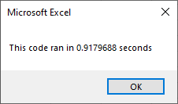
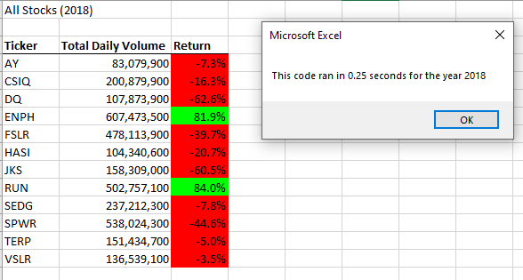

# VBA Challenge  
  
# Summary reoprt of the results of the Module 2 challenge  
  
## Data summary  
[data file](VBA_Challenge.xlsm)  
The raw data file contains stock performance data from 2017 and 2018 for a suite of 12 stocks.  
Each year is in a separate worksheet containing 3012 rows of data.  
The columns are the stock ticker, trading date, opening price, high price, low price, close prices, adjusted price, and shares traded.  
  
## Overview of the project  
Steves' parents want to invest in an environmentlally friendly stock.  He asked for help to analyse and clearly summarize performance data for 12 green stocks from 2017 and 2018.  Steve wants to know the total volume traded per year and the annual return for the 12 stocks.  
  
Performing the analysis for a single stock in Excel involves filtering the data by stock ticker name, identifying the first trading day, identifying the last trading day, calculating the annual return, and summing the daily trade volumes.  THe procedure is labor intensive, prone to errors, and repetative to apply to the entire data set.  The analysis lends itself  to creating an algorithm in VBA to perform the calculation.  The project delivery is a VBA macro that creates a summary table of the 12 stocks for any given year at the touch of a button.  
  
Going forward, Steve will likely use the macro on spreadsheets with more than the 12 stocks in this analysis and possibly over different time frames.  WIth that possibility in mind I refactored the script to improve run times.  
The initial version of the VBA macro included hard coded values for worksheet names and the total number of rows of data as well as multiple loops through the data do collect the required information.  
The refactored version takes user input to define the worksheet,determines the last row of data automatically (code taken from StackOverflow), and performs the data collection with a single loop through the data.  
Rather than writing the results to the output worksheet within the loop the refactored version stores the data in arrays.  The data are then written to the output spreadsheet from the arrays after the loop through the data.
  
The final version can be further improved by automating the population of the array of stock ticker values rather than relying on hard coding the array  
    
## Results  
  
For each of the 12 green stocks in the raw data worksheets, the VBA macro calculates the total volume of trades for the selected year, determines the first and last trading days of the year, calculates the percent change in stock price (end of year closing price / start of year closing price - 1), and formats a summary data table to be easily readable.  
  
Most of the stocks had strong results in 2017  
  
  
  
2018 was a different story; most of the stocks performed poorly.  Only Enphase Energy (stock ticker ENPH) and Sunrun (stock ticker RUN) posted an increase in stock price over the year.  
  
  
  
The script refactoring made a significant difference in terms of computational speed.  
The initial code that featured multiple runs through the data to collect the required information run in about 1 second.  
  
  
  
The code is quite inefficient.  
  
  
  
After refactoring the code is significantly faster.  
  
  

  
  
  
  
## Summary  
  
- Refactoring the script makes a significant difference in performance.  In the original form the code takes approximately 1 second to run.  Changing to a single loop through the data and saving results to arrays rather than outputting the results to the output worksheet for each stock decreases the run times to approximately 0.25 seconds.  
- The initial version of the script had the advantage of being easy to understand and to debug.  There are easy, logical places to add message boxes to allow the developer to understand how variables are changing and if the loops are performing as expected.  
- Spending the time to write the script out in a long, simple form insures that the logic is correct and the results are as expected.  
- Once the script is working properly the refactoring greatly improves the code efficiency.  
